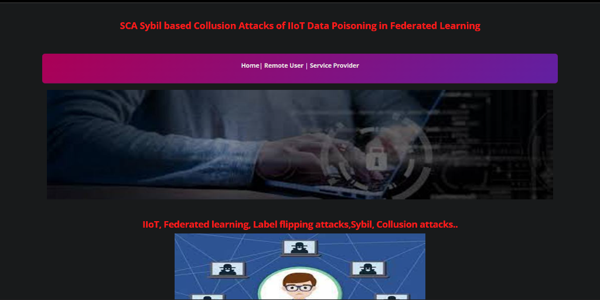

# Sybil-Based Collusion Attacks in IIoT Federated Learning

## 1. Project Overview
This project is a web application that functions as a Centralized Machine Learning Defense Gateway. It is specifically designed to detect and intercept malicious cyberattacks, specifically Sybil-based Collusion Attacks, within Federated Learning environments utilized by Industrial IoT (IIoT) devices. By analyzing network traffic behavior, it prevents malicious nodes from successfully poisoning a shared global AI model.

## 2. The Problem Statement
Federated Learning (FL) allows distributed IoT devices to train AI models collaboratively locally without sharing raw, private data with a central server. While highly valuable for privacy, FL introduces a critical vulnerability: Label-Flipping Data Poisoning.

If an attacker physically or remotely compromises a portion of the network, they can generate multiple fake identities (a Sybil attack). These spoofed devices can successfully team up (collude) to mathematically poison their local model updates. Because the central FL server operates on a "blind trust" protocol (it cannot see the raw data to verify), it blindly accepts these poisoned updates during the aggregation phase, fundamentally corrupting the accuracy of the global AI.

This project serves as the Intrusion Detection System that prevents this vulnerability by auditing the network traffic patterns of connecting devices before they are allowed to participate in model aggregation.

## 3. Application Workflow
Our defense platform operates as a secure gateway between the IIoT devices and the FL Central Server. It utilizes Traditional Machine Learning models as opposed to Deep Learning to perform highly efficient network traffic analysis.

The system is split into two primary interfaces:

1. **The Remote User (The Client/IIoT Node):** End-users or automated IIoT devices log into the platform and submit their device's specific network traffic parameters (such as source IP, destination port, packet count, byte count, etc.). The Machine Learning backend immediately processes this data and predicts whether the traffic footprint is benign or resembles the signature of a Sybil-based collusion attacker.
2. **The Service Provider (The Admin/Server):** A monitoring dashboard for network administrators. The provider can view all connected user nodes, initialize the training phase of the machine learning ensemble on historical network datasets, view ratios of normal versus malicious traffic, and quantitatively compare the accuracy convergence of the different ML algorithms.

## 4. Technical Architecture

### Backend Framework
* **Core:** Built utilizing Django (Python) for robust session handling, routing, and database interactions. It is configured for SQLite3 to enable seamless local deployment without complex external database requirements.
* **Data Processing Layer:** Because machine learning algorithms require numerical inputs, the system implements Natural Language Processing logic via `CountVectorizer` (from the Scikit-Learn library). This component parses complex, unstructured network log text strings (`Network_Node_Text`) into an easily analyzable sparse mathematical matrix.

### Machine Learning Pipeline
The detection system extracts features from a dataset of approximately 40,000 historical IIoT network traffic records (`Network_Datasets.csv`). The platform trains a comprehensive ensemble of 5 Machine Learning Classifiers:

1. **Naive Bayes (MultinomialNB):** A highly efficient, probabilistic classifier that specializes in evaluating the text-based network features extracted by the vectorizer.
2. **Support Vector Machine (SVM):** A complex mathematical classifier that plots network data in multi-dimensional space to define the widest optimal hyperplane separating benign traffic from malicious packets.
3. **Logistic Regression:** A resilient binary classifier that utilizes a sigmoid curve function to predict the exact probability percentage of an attack.
4. **Decision Tree Classifier:** A model optimized for identifying hidden non-linear relationships in network data branches (for example, isolating a specific port correlating with a specific high packet count).
5. **SGD Classifier (Stochastic Gradient Descent):** An advanced optimization model that computes incredibly fast, singular gradient updates suitable for processing large-scale datasets.

### The Core Detection Mechanism
The system leverages these predictive classifiers in a unified structure to make highly accurate, real-time determinations on live internal network traffic to successfully identify and flag obfuscated Sybil entities.

## 5. Live Demonstration Instructions
To execute a live demonstration of the ML defense mechanisms, follow this structured execution flow:

1. **Deploy the Local Environment:** Execute the command `python manage.py runserver` from the command line interface and wait for the Django development server to initialize at `http://127.0.0.1:8000/`.
2. **Train the Defense Algorithms (Admin View):** Access the Service Provider login page (`/serviceproviderlogin/`) utilizing the administrative credentials. Navigate to the "Train Model" panel. This action instructs the Python backend to parse the empirical CSV dataset, trigger the vectorizer process, and train the five discrete Machine Learning models.
3. **Analyze System Accuracy:** Once training concludes, display the generated Accuracy Bar Charts and Line Charts to visually demonstrate model convergence and relative performance metrics.
4. **Execute an Active Prediction (User View):** Terminate the admin session and return to the main portal. Register a mock IIoT Remote User account and authenticate. Select an established "Attack" data row (Label = 1) from the `Network_Datasets.csv` repository. Input these discrete network parameters into the manual Prediction Form and submit the request to demonstrate the platform actively intercepting the Sybil threat in real-time.

## 6. System Screenshots

Below are captures of the live system demonstrating the user interface and machine learning accuracy charting:

**Main Gateway Interface:**

**Authentication Portal:**

